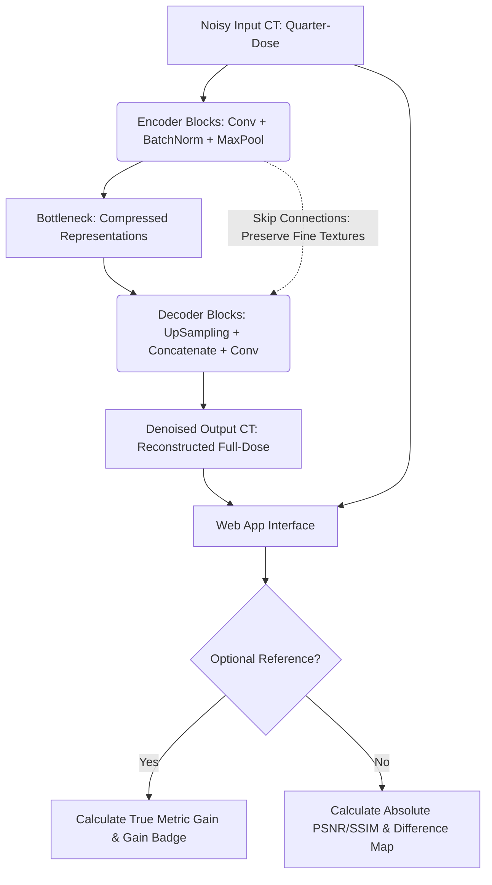

# Medical CT Denoise AI 🩺

[](https://tensorflow.org)
[](https://flask.palletsprojects.com/)
[](https://www.docker.com/)
[](https://opensource.org/licenses/MIT)

**Medical CT Denoise AI** is a state-of-the-art deep learning system powered by a **U-Net Convolutional Autoencoder** to reconstruct high-fidelity, clean CT images from low-dose, high-noise clinical scans. 

By utilizing deep learning to restore quarter-dose (low radiation) CT scans, this system addresses a critical challenge in modern radiology: **minimizing patient radiation exposure while maintaining high diagnostic clarity.**

---

## 📸 Interactive Web Dashboard

The project includes a production-ready, beautiful Glassmorphism web interface where clinical professionals can upload low-dose scans, evaluate AI-driven restoration results in real-time, and download complete metric reports.

- **Real-Time Difference Map Generation**: Visually isolates and highlights exactly what noise/artifacts the AI removed, assuring clinical specialists that anatomical structures remain intact.
- **Objective Metric Analytics**: Calculates **PSNR (Peak Signal-to-Noise Ratio)** and **SSIM (Structural Similarity Index)** on the fly.
- **True Metrics Benchmarking**: If an optional reference (Full-Dose) image is uploaded, the platform computes absolute initial/final quality values and logs the **Net Clarity Gain (dB)**.

---

## 🛠️ System & Pipeline Architecture

The core of the system is built on a custom symmetric **U-Net** architecture. Skip connections pass high-resolution details directly from the contracting path (Encoder) to the expansive path (Decoder), preserving fine clinical features like tissues and micro-lesions.



---

## 🧠 Deep Learning Implementation Details

### Model Architecture
- **Input Dimensions**: 256x256x1 (Single channel grayscale CT scan).
- **Encoder Path**: Multi-stage Convolutional layers (3x3 filters, ReLU) coupled with **Batch Normalization** to stabilize training dynamics, followed by Max Pooling (2x2) for spatial reduction.
- **Decoder Path**: Up-sampling (2x2) followed by **feature map concatenation** with matching encoder layers (Skip Connections) to restore anatomical structure, concluded by a 1x1 Convolution with Sigmoid activation.
- **Optimization Strategy**: Trained using **Mean Squared Error (MSE)** loss, minimizing structural deviation, optimized with the **Adam Optimizer**.

### Optimized tf.data Input Pipeline
To prevent CPU bottlenecking and system memory leaks when handling heavy medical datasets, training pipelines are built using the TensorFlow `tf.data` API:
- **Parallel Processing**: Asynchronous mapping (`num_parallel_calls=tf.data.AUTOTUNE`).
- **Memory Optimization**: Dynamic prefetching (`prefetch(buffer_size=tf.data.AUTOTUNE)`) overlapping image loading and GPU operations.

---

## 🚀 Quick Start Guide

### 1. Local Development Setup

Ensure you have Python 3.10+ installed.

```bash
# Clone the repository
git clone https://github.com/yourusername/medical-ct-denoise-ai.git
cd medical-ct-denoise-ai

# Create and activate virtual environment
python -m venv venv
venv\Scripts\activate # On Linux: source venv/bin/activate

# Install requirements
pip install -r requirements.txt
```

### 2. Run the Web Application
```bash
python app.py
```
Open your browser and navigate to `http://127.0.0.1:5000`.

---

## 🐳 Docker Deployment (Production-Ready)

To ensure consistent runtime environments across local setups and cloud instances (like Hugging Face Spaces), the system is fully containerized.

```bash
# Build the Docker image
docker build -t medical-ct-denoise-ai .

# Run the container
docker run -p 7860:7860 medical-ct-denoise-ai
```

> [!NOTE]
> **Production Scaling Safeguard**: The `Dockerfile` uses a multi-threaded **Gunicorn WSGI server** configured with strict worker limits (`--workers 1 --threads 4`). This safely controls TensorFlow's CPU threading, eliminating Out-Of-Memory (OOM) crashes common when scaling deep learning models on standard cloud instances.

---

## 🧪 Clinical Quality Evaluation Metrics

The system measures the quality of the image reconstruction using two core standards in digital image processing:

1. **Peak Signal-to-Noise Ratio (PSNR)**:
   $$\text{PSNR} = 10 \cdot \log_{10}\left(\frac{\text{MAX}^2}{\text{MSE}}\right)$$
   *A higher value indicates less noise. A **+3dB increase** represents a **50% reduction in noise power**.*

2. **Structural Similarity Index (SSIM)**:
   Measures luminance, contrast, and structure similarity against the reference scan, scaled between `0` (no similarity) and `1` (perfect reconstruction).

---

## 📂 Project Structure

```text
├── app.py                      # Flask Application Server & API endpoints
├── train_medical_ct.py         # Standard local training script (U-Net & tf.data)
├── kaggle_train_medical.py     # Training script optimized for Kaggle GPU environments
├── Dockerfile                  # Lightweight Python containerization
├── requirements.txt            # Python dependencies (TensorFlow-CPU, Flask, Pillow, etc.)
├── templates/
│   └── index.html              # Modern, responsive Glassmorphism dashboard UI
└── static/
    └── uploads/                # Temporary directory for processing uploaded scans
```

---

## 📜 License
This project is licensed under the MIT License - see the [LICENSE](LICENSE) file for details.
